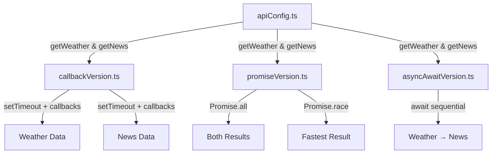

<p align="center">
  
  
  
</p>

#  Async Weather & News Dashboard

> **A hands-on Node.js + TypeScript project exploring three asynchronous patterns — Callbacks, Promises, and Async/Await — by fetching real-time weather and news data from public APIs.**

---

##  Table of Contents

- [Overview](#overview)
- [Features](#features)
- [Tech Stack](#tech-stack)
- [Project Structure](#project-structure)
- [Prerequisites](#prerequisites)
- [Installation](#installation)
- [Configuration](#configuration)
- [Usage](#usage)
  - [Callback Version](#1-callback-version)
  - [Promise Version](#2-promise-version)
  - [Async/Await Version](#3-asyncawait-version)
- [How It Works](#how-it-works)
- [API Reference](#api-reference)
- [Contributing](#contributing)
- [License](#license)

---

## Overview

This project serves as a practical demonstration of the three core asynchronous programming patterns in JavaScript/TypeScript:

| Pattern | File | Description |
|---------|------|-------------|
| **Callbacks** | `src/callbackVersion.ts` | Traditional callback-based flow with `setTimeout` to simulate delayed responses |
| **Promises** | `src/promiseVersion.ts` | Uses `Promise.all` for concurrent fetching and `Promise.race` for first-response wins |
| **Async/Await** | `src/asyncAwaitVersion.ts` | Modern, clean sequential execution using `async`/`await` syntax |

Each version fetches **weather data** (via [OpenWeatherMap](https://openweathermap.org/api)) and **news articles** (via [NewsAPI](https://newsapi.org/)) to showcase how the same task looks under different async paradigms.

---

## Features

-  **Real-time weather** — Fetches current weather for any city (default: Polokwane)
-  **Latest news** — Retrieves top articles by topic (default: technology)
-  **Three async patterns** — Side-by-side comparison of callbacks, promises, and async/await
-  **Shared API layer** — Centralized `apiConfig.ts` module used by all versions
-  **Error handling** — Each pattern demonstrates proper error propagation
-  **TypeScript** — Fully typed for safety and better developer experience

---

## Tech Stack

| Tool | Purpose |
|------|---------|
| [Node.js](https://nodejs.org/) | JavaScript runtime |
| [TypeScript](https://www.typescriptlang.org/) | Static typing & compilation |
| [OpenWeatherMap API](https://openweathermap.org/api) | Weather data provider |
| [NewsAPI](https://newsapi.org/) | News article provider |
| [dotenv](https://www.npmjs.com/package/dotenv) | Environment variable management |

---

## Project Structure

```
Async-Weather---News-Dashboard-node-/
├── src/
│   ├── apiConfig.ts            # Shared API functions (getWeather, getNews)
│   ├── callbackVersion.ts      # Callback-based implementation
│   ├── promiseVersion.ts       # Promise-based implementation (Promise.all & Promise.race)
│   └── asyncAwaitVersion.ts    # Async/Await implementation
├── dist/                       # Compiled JavaScript output
├── .env                        # Environment variables (API keys)
├── package.json                # Dependencies & scripts
├── tsconfig.json               # TypeScript compiler configuration
└── README.md
```

---

## Prerequisites

- **Node.js** v18+ — [Download](https://nodejs.org/)
- **npm** v9+ (comes with Node.js)
- **API Keys** for:
  - [OpenWeatherMap](https://home.openweathermap.org/users/sign_up) (free tier)
  - [NewsAPI](https://newsapi.org/register) (free tier for development)

---

## Installation

```bash
# 1. Clone the repository
git clone https://github.com/itumeleng-itu/Async-Weather---News-Dashboard-node-.git

# 2. Navigate into the project
cd Async-Weather---News-Dashboard-node-

# 3. Install dependencies
npm install
```

---

## Configuration

Create a `.env` file in the project root with your API keys:

```env
WEATHER_API_KEY=your_openweathermap_api_key
NEWS_API_KEY=your_newsapi_api_key
```

> [!NOTE]
> The current implementation has API keys hardcoded in `apiConfig.ts`. For production use, migrate these to environment variables loaded via `dotenv`.

---

## Usage

### Build the project

Compile TypeScript to JavaScript:

```bash
npx tsc
```

### Run the examples

#### 1. Callback Version

Uses `setTimeout` to simulate asynchronous delays and callbacks for handling responses.

```bash
node dist/callbackVersion.js
```

**What to expect:**
- Weather data arrives after **~3 seconds**
- News data arrives after **~6 seconds**
- Results are independent of each other

#### 2. Promise Version

Demonstrates `Promise.all` (wait for everything) and `Promise.race` (first one wins).

```bash
node dist/promiseVersion.js
```

**What to expect:**
- Both requests fire concurrently
- `Promise.all` waits for **both** to complete (~7 seconds)
- `Promise.race` resolves with whichever returns **first**

#### 3. Async/Await Version

Clean, sequential execution using modern syntax.

```bash
node dist/asyncAwaitVersion.js
```

**What to expect:**
- Weather data fetched **first**
- News data fetched **after** weather completes
- Sequential but readable flow

---

## How It Works



### Key Concepts Demonstrated

| Concept | Where |
|---------|-------|
| **Callback pattern** | `callbackVersion.ts` — wrapping async ops in `setTimeout` with callback functions |
| **Promise.all** | `promiseVersion.ts` — concurrent execution, waits for all promises |
| **Promise.race** | `promiseVersion.ts` — concurrent execution, resolves with first settled promise |
| **Async/Await** | `asyncAwaitVersion.ts` — syntactic sugar over promises for sequential async code |
| **Error handling** | All versions — `try/catch`, `.catch()`, and error callbacks |
| **Module system** | `apiConfig.ts` — shared, reusable API functions via ES module exports |

---

## API Reference

### `getWeather(cityName: string | null): Promise<object>`

Fetches current weather data from OpenWeatherMap.

| Parameter | Type | Description |
|-----------|------|-------------|
| `cityName` | `string \| null` | Name of the city to query |

**Returns:** Weather data object including temperature, conditions, humidity, etc.

---

### `getNews(topic: string | null): Promise<object>`

Fetches the top news article for a given topic from NewsAPI.

| Parameter | Type | Description |
|-----------|------|-------------|
| `topic` | `string \| null` | Search keyword for articles |

**Returns:** Article object with title, description, author, and URL.

---

## Contributing

Contributions are welcome! Here's how you can help:

1. **Fork** the repository
2. **Create** a feature branch (`git checkout -b feature/amazing-feature`)
3. **Commit** your changes (`git commit -m 'Add amazing feature'`)
4. **Push** to the branch (`git push origin feature/amazing-feature`)
5. **Open** a Pull Request

### Ideas for Contributions

- [ ] Migrate hardcoded API keys to `.env` variables
- [ ] Add a CLI interface for custom city/topic input
- [ ] Add unit tests with Jest
- [ ] Create a web-based dashboard frontend
- [ ] Add more async patterns (Observables, Streams, Event Emitters)

---

## License

This project is licensed under the **ISC License**. See the [LICENSE](LICENSE) file for details.

---

<p align="center">
  Made with ☕ and curiosity
</p>
